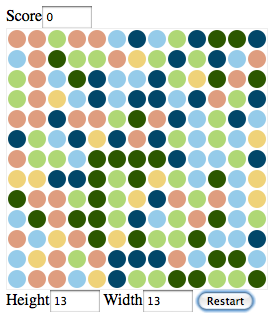
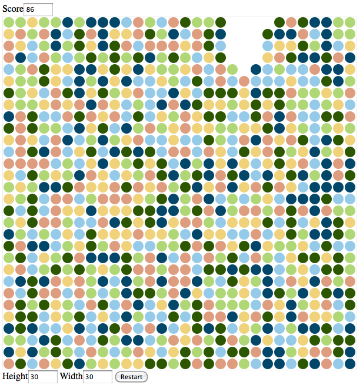

Intro
=====

A Bubble Breaker Game using the Canvas Tag and JS. Written in a just a few 
hours, so it's dirty! I've only tested in Firefox 3.6.

It has basic scoring and the ability to change the grid dimensions.

* [Blog Entry](https://antiquity.jamie.ly/programming/bubble-breaker-using-canvas/)
* [Demo](http://jamiely.github.io/bubble-breaker-canvas/)

Media
=====

